```mermaid
graph TD
    A[Customer] --> B[Login/Register]
    A --> C[Browse Tenants]
    A --> D[View Menus]
    A --> E[Add to Cart]
    A --> F[Checkout]
    A --> G[Payment]
    A --> H[Order History]
    A --> I[Profile Management]

    J[Tenant Owner] --> K[Login]
    J --> L[Dashboard]
    J --> M[Menu Management]
    J --> N[Stock Management]
    J --> O[Order Processing]
    J --> P[Sales Reports]
    J --> Q[Tenant Settings]

    R[Administrator] --> S[Login]
    R --> T[Dashboard]
    R --> U[User Management]
    R --> V[Tenant Management]
    R --> W[Menu Oversight]
    R --> X[Order Management]
    R --> Y[Analytics & Reports]
    R --> Z[System Settings]
```

# Use Case Documentation - e-Kantin SMKN 2 Surabaya

## 📋 Table of Contents
1. [System Overview](#system-overview)
2. [Actors/Users](#actorsusers)
3. [Use Case Diagram](#use-case-diagram)
4. [Detailed Use Cases](#detailed-use-cases)
5. [Business Processes](#business-processes)
6. [System Requirements](#system-requirements)

---

## 🏢 System Overview

**e-Kantin SMKN 2 Surabaya** adalah sistem manajemen kantin berbasis web yang menghubungkan tenant (penjual makanan), pelanggan (siswa/guru/staf), dan administrator sekolah dalam satu platform terintegrasi.

### **Main Features:**
- Multi-tenant architecture
- Online ordering system
- Payment processing (Cash & Cashless)
- Inventory management
- Analytics & reporting
- User management

---

## 👥 Actors/Users

### **1. Pelanggan (Customer)**
- Siswa, guru, dan staf SMKN 2 Surabaya
- Melakukan browsing menu, pemesanan, dan pembayaran

### **2. Tenant Owner (Penyewa Kantin)**
- Pemilik/usaha kantin di area sekolah
- Mengelola menu, stok, dan pesanan

### **3. Administrator**
- Operator sistem sekolah
- Mengelola pengguna, tenant, dan laporan

---

## 🎯 Use Case Diagram



---

## 📝 Detailed Use Cases

### **A. CUSTOMER USE CASES**

#### **UC-01: Registrasi Akun**
**Actor:** Pelanggan
**Description:** Pengguna baru mendaftar untuk membuat akun pelanggan

**Preconditions:**
- Pengguna memiliki email sekolah yang valid
- Pengguna belum terdaftar dalam sistem

**Main Flow:**
1. Pengguna mengakses halaman registrasi
2. Mengisi form: nama, email, password, konfirmasi password
3. Sistem memvalidasi data input
4. Sistem mengirim email verifikasi
5. Pengguna klik link verifikasi di email
6. Akun berhasil dibuat, pengguna diarahkan ke login

**Alternative Flows:**
- 3a: Email sudah terdaftar → Sistem tampilkan pesan error
- 3b: Password tidak match → Sistem tampilkan pesan error
- 5a: Link verifikasi kadaluarsa → Sistem tampilkan opsi kirim ulang

**Postconditions:**
- Akun pelanggan berhasil dibuat
- Email terverifikasi
- Pengguna dapat login ke sistem

---

#### **UC-02: Login**
**Actor:** Pelanggan, Tenant Owner, Administrator
**Description:** Pengguna masuk ke sistem dengan kredensial yang valid

**Preconditions:**
- Pengguna memiliki akun yang terdaftar
- Akun sudah diverifikasi (untuk pelanggan)

**Main Flow:**
1. Pengguna mengakses halaman login
2. Memasukkan email dan password
3. Sistem memvalidasi kredensial
4. Sistem mengidentifikasi role pengguna
5. Pengguna diarahkan ke dashboard sesuai role

**Alternative Flows:**
- 3a: Email/password salah → Tampilkan pesan error6
- 3b: Akun belum diverifikasi → Tampilkan pesan verifikasi
- 3c: Akun diblokir → Tampilkan pesan hubungi admin

**Postconditions:**
- Pengguna berhasil login
- Sesi pengguna aktif
- Dashboard sesuai role ditampilkan

---

#### **UC-03: Browse Tenants**
**Actor:** Pelanggan
**Description:** Melihat daftar tenant kantin yang tersedia

**Preconditions:**
- Pengguna sudah login

**Main Flow:**
1. Pengguna memilih menu "Tenants"
2. Sistem menampilkan daftar tenant dengan informasi:
   - Nama tenant
   - Deskripsi singkat
   - Jumlah menu tersedia
   - Status operasional
3. Pengguna dapat filter dan sort tenant

**Alternative Flows:**
- 2a: Tidak ada tenant aktif → Tampilkan pesan "Belum ada tenant aktif"

**Postconditions:**
- Daftar tenant ditampilkan
- Pengguna dapat memilih tenant untuk melihat menu

---

#### **UC-04: View Menus**
**Actor:** Pelanggan
**Description:** Melihat menu yang tersedia di tenant tertentu

**Preconditions:**
- Pengguna sudah login
- Tenant dipilih dari daftar tenant

**Main Flow:**
1. Pengguna klik tenant dari daftar
2. Sistem menampilkan halaman menu dengan:
   - Foto menu
   - Nama menu
   - Harga
   - Deskripsi
   - Stok tersedia
   - Status ketersediaan
3. Pengguna dapat filter berdasarkan kategori
4. Pengguna dapat search menu

**Alternative Flows:**
- 2a: Tenant tidak memiliki menu → Tampilkan pesan "Belum ada menu"
- 2b: Menu sedang habis → Tampilkan indikator "Habis"

**Postconditions:**
- Menu tenant ditampilkan
- Pengguna dapat menambah ke keranjang

---

#### **UC-05: Add to Cart**
**Actor:** Pelanggan
**Description:** Menambah menu ke keranjang belanja

**Preconditions:**
- Pengguna sudah login
- Menu tersedia dan stok mencukupi

**Main Flow:**
1. Pengguna klik menu yang diinginkan
2. Sistem menampilkan detail menu
3. Pengguna input jumlah pesanan
4. Sistem validasi stok tersedia
5. Pengguna klik "Tambah ke Keranjang"
6. Item berhasil ditambahkan ke keranjang

**Alternative Flows:**
- 4a: Stok tidak mencukupi → Tampilkan pesan "Stok tidak mencukupi"
- 5a: Item sudah ada di keranjang → Update jumlah
- 5b: Keranjang dari tenant berbeda → Tampilkan peringatan ganti keranjang

**Postconditions:**
- Item ditambahkan ke keranjang
- Keranjang diperbarui
- Notifikasi berhasil ditampilkan

---

#### **UC-06: Manage Cart**
**Actor:** Pelanggan
**Description:** Mengelola item di keranjang belanja

**Preconditions:**
- Pengguna sudah login
- Ada item di keranjang

**Main Flow:**
1. Pengguna akses halaman keranjang
2. Sistem menampilkan item per tenant
3. Pengguna dapat:
   - Update jumlah item
   - Hapus item
   - Lanjut ke checkout
4. Sistem update total harga otomatis

**Alternative Flows:**
- 3a: Update jumlah melebihi stok → Tampilkan warning dan adjust ke stok maksimal
- 3b: Hapus semua item → Keranjang kosong

**Postconditions:**
- Keranjang diperbarui
- Total harga terkini
- Pengguna dapat lanjut checkout

---

#### **UC-07: Checkout**
**Actor:** Pelanggan
**Description:** Melakukan checkout pesanan

**Preconditions:**
- Pengguna sudah login
- Ada item di keranjang
- Stok mencukupi

**Main Flow:**
1. Pengguna klik "Checkout" dari keranjang
2. Sistem menampilkan ringkasan pesanan
3. Pengguna konfirmasi detail pesanan
4. Sistem generate order dengan kode unik
5. Pesanan dibuat dengan status "pending"

**Alternative Flows:**
- 3a: Ada perubahan stok → Sistem adjust dan notifikasi
- 4a: Gagal generate kode → Retry dengan kode baru

**Postconditions:**
- Order berhasil dibuat
- Keranjang kosong
- Pengguna diarahkan ke pembayaran

---

#### **UC-08: Payment Processing**
**Actor:** Pelanggan
**Description:** Melakukan pembayaran pesanan

**Preconditions:**
- Order sudah dibuat
- Status order "pending"

**Main Flow:**
1. Pengguna diarahkan ke halaman pembayaran
2. Sistem menampilkan detail order dan pilihan metode pembayaran
3. Pengguna pilih metode:
   - **Cash:** Tunai di kantin
   - **Cashless:** QRIS/E-Wallet/Transfer
4. Untuk cashless:
   - Sistem generate payment Midtrans
   - Pengguna selesaikan pembayaran
   - Sistem verifikasi pembayaran
5. Untuk cash:
   - Status order berubah "pending_cash"
   - Sistem tampilkan kode pesanan

**Alternative Flows:**
- 4a: Pembayaran cashless gagal → Tampilkan opsi retry
- 5a: Konfirmasi pembayaran cash gagal → Retry

**Postconditions:**
- Pembayaran diproses
- Order status terupdate
- Notifikasi dikirim ke tenant

---

#### **UC-09: Order History**
**Actor:** Pelanggan
**Description:** Melihat riwayat pesanan

**Preconditions:**
- Pengguna sudah login

**Main Flow:**
1. Pengguna akses "Riwayat Pesanan"
2. Sistem menampilkan daftar pesanan dengan:
   - Kode pesanan
   - Tenant
   - Total harga
   - Status
   - Tanggal pemesanan
3. Pengguna dapat lihat detail pesanan
4. Pengguna dapat download invoice (jika lunas)

**Postconditions:**
- Riwayat pesanan ditampilkan
- Pengguna dapat track status pesanan

---

### **B. TENANT OWNER USE CASES**

#### **UC-10: Tenant Dashboard**
**Actor:** Tenant Owner
**Description:** Melihat dashboard overview tenant

**Preconditions:**
- Tenant owner sudah login
- Tenant terdaftar dan aktif

**Main Flow:**
1. Tenant owner akses dashboard
2. Sistem menampilkan:
   - Statistik hari ini (penjualan, order)
   - Menu terlaris
   - Stok menipis
   - Pesanan pending
3. Owner dapat navigasi ke fitur lain

**Postconditions:**
- Dashboard overview ditampilkan
- Owner dapat monitor performa bisnis

---

#### **UC-11: Menu Management**
**Actor:** Tenant Owner
**Description:** Mengelola menu makanan/minuman

**Preconditions:**
- Tenant owner sudah login
- Memiliki akses ke menu tenant

**Main Flow:**
1. Owner akses "Menu Management"
2. Sistem menampilkan daftar menu tenant
3. Owner dapat:
   - Tambah menu baru
   - Edit menu existing
   - Hapus menu
   - Update status ketersediaan
4. Setiap perubahan disimpan ke database

**Alternative Flows:**
- 3a: Hapus menu yang ada di order aktif → Warning dan konfirmasi
- 3b: Upload foto gagal → Tampilkan error dan retry

**Postconditions:**
- Menu tenant diperbarui
- Perubahan refleks di customer view

---

#### **UC-12: Stock Management**
**Actor:** Tenant Owner
**Description:** Mengelola stok menu

**Preconditions:**
- Tenant owner sudah login
- Menu sudah ada

**Main Flow:**
1. Owner akses "Stock Management"
2. Sistem menampilkan semua menu dengan stok
3. Owner dapat update stok:
   - Input stok baru
   - Adjustment stok (penambahan/pengurangan)
4. Sistem update stok real-time
5. Auto-sync dengan keranjang customer

**Alternative Flows:**
- 3a: Stok negatif → Tampilkan warning dan prevent
- 4a: Stok menipis (<10) → Auto warning

**Postconditions:**
- Stok menu terupdate
- Customer view stok terkini
- Warning untuk stok menipis

---

#### **UC-13: Order Processing**
**Actor:** Tenant Owner
**Description:** Memproses pesanan customer

**Preconditions:**
- Tenant owner sudah login
- Ada pesanan masuk

**Main Flow:**
1. Owner dapat notifikasi pesanan baru
2. Owner akses "Pesanan Masuk"
3. Owner dapat:
   - View detail pesanan
   - Update status (pending → diproses → selesai)
   - Konfirmasi pembayaran cash
4. Customer dapat tracking status update

**Alternative Flows:**
- 3a: Pesanan dibatalkan customer → Update status
- 3b: Stok habis saat proses → Notifikasi customer

**Postconditions:**
- Status pesanan terupdate
- Customer dapat tracking real-time
- Notifikasi otomatis ke customer

---

#### **UC-14: Sales Reports**
**Actor:** Tenant Owner
**Description:** Melihat laporan penjualan

**Preconditions:**
- Tenant owner sudah login
- Ada data transaksi

**Main Flow:**
1. Owner akses "Laporan Penjualan"
2. Sistem menampilkan analytics:
   - Penjualan harian/mingguan/bulanan
   - Menu terlaris
   - Pendapatan total
   - Trend pertumbuhan
3. Owner dapat filter periode tanggal
4. Owner dapat export laporan

**Alternative Flows:**
- 2a: Tidak ada data → Tampilkan pesan "Belum ada transaksi"
- 3a: Invalid date range → Tampilkan error

**Postconditions:**
- Laporan penjualan ditampilkan
- Owner dapat analisis performa bisnis

---

### **C. ADMINISTRATOR USE CASES**

#### **UC-15: User Management**
**Actor:** Administrator
**Description:** Mengelola pengguna sistem

**Preconditions:**
- Administrator sudah login
- Memiliki hak akses admin

**Main Flow:**
1. Admin akses "User Management"
2. Sistem menampilkan daftar semua pengguna
3. Admin dapat:
   - Tambah user baru
   - Edit user existing
   - Update role (admin/tenant/customer)
   - Reset password
   - Aktifkan/nonaktifkan user
4. Setiap perubahan disimpan

**Alternative Flows:**
- 3a: Hapus user dengan pesanan aktif → Warning dan prevent
- 3b: Email sudah ada → Tampilkan error

**Postconditions:**
- Data user terupdate
- Hak akses terkontrol

---

#### **UC-16: Tenant Management**
**Actor:** Administrator
**Description:** Mengelola tenant kantin

**Preconditions:**
- Administrator sudah login

**Main Flow:**
1. Admin akses "Tenant Management"
2. Sistem menampilkan daftar tenant
3. Admin dapat:
   - Tambah tenant baru
   - Edit tenant data
   - Aktifkan/nonaktifkan tenant
   - Assign tenant owner
4. Admin dapat view performa tenant

**Alternative Flows:**
- 3a: Nonaktifkan tenant dengan pesanan aktif → Warning
- 3b: Tenant owner sudah ada tenant → Warning

**Postconditions:**
- Data tenant terupdate
- Operasional kantin terkontrol

---

#### **UC-17: Order Management (Admin)**
**Actor:** Administrator
**Description:** Monitoring semua pesanan sistem

**Preconditions:**
- Administrator sudah login

**Main Flow:**
1. Admin akses "All Orders"
2. Sistem menampilkan semua pesanan dari semua tenant
3. Admin dapat:
   - Filter berdasarkan tenant, status, tanggal
   - View detail pesanan
   - Export data pesanan
   - Monitor problematic orders
4. Admin dapat intervene jika ada masalah

**Postconditions:**
- Semua pesanan termonitor
- Admin dapat oversight penuh

---

#### **UC-18: Analytics & Reports**
**Actor:** Administrator
**Description:** Melihat analytics dan laporan komprehensif

**Preconditions:**
- Administrator sudah login

**Main Flow:**
1. Admin akses "Reports"
2. Sistem menampilkan dashboard analytics:
   - Overall revenue dan statistics
   - Top performing tenants
   - Top selling menu items
   - Payment method distribution
   - Order status analytics
   - Customer growth trends
   - Category performance
3. Admin dapat filter date range
4. Admin dapat export reports

**Alternative Flows:**
- 2a: Database error → Tampilkan error dan log
- 3a: Invalid date range → Reset ke default range

**Postconditions:**
- Analytics komprehensif ditampilkan
- Admin dapat membuat business decision

---

## 🔄 Business Processes

### **1. Customer Ordering Process**
```
Customer Login → Browse Tenants → Select Menu → Add to Cart → Checkout → Payment → Order Confirmation → Order Processing → Order Completion
```

### **2. Tenant Order Fulfillment**
```
Receive Order → Review Order → Process Order → Update Stock → Complete Order → Payment Confirmation
```

### **3. Admin Oversight**
```
Monitor System → Manage Users → Oversee Operations → Generate Reports → System Maintenance
```

---

## 📋 System Requirements

### **Functional Requirements**

#### **Authentication & Authorization**
- User registration with email verification
- Role-based access control (Admin, Tenant, Customer)
- Password reset functionality
- Session management

#### **Menu & Inventory Management**
- CRUD operations for menus
- Real-time stock tracking
- Automatic stock synchronization
- Image upload for menu items

#### **Order Processing**
- Multi-tenant cart system
- Order status tracking
- Real-time notifications
- Order history and analytics

#### **Payment Processing**
- Multiple payment methods (Cash, Cashless)
- Integration with Midtrans
- Payment status tracking
- Invoice generation

#### **Reporting & Analytics**
- Sales reports per tenant
- System-wide analytics
- Performance metrics
- Export functionality

### **Non-Functional Requirements**

#### **Performance**
- Response time < 2 seconds
- Support 100+ concurrent users
- Real-time stock updates

#### **Security**
- HTTPS encryption
- SQL injection prevention
- XSS protection
- CSRF protection
- Input validation

#### **Usability**
- Responsive design for mobile
- Intuitive user interface
- Accessibility compliance
- Multi-language support (Indonesia/English)

#### **Reliability**
- 99.9% uptime
- Data backup and recovery
- Error handling and logging
- Graceful degradation

#### **Scalability**
- Handle growth to 50+ tenants
- Support 1000+ daily orders
- Database optimization
- Caching implementation

---

## 🎯 Success Metrics

### **Business Metrics**
- Increase in order volume
- Reduction in order processing time
- Customer satisfaction rate
- Tenant revenue growth

### **Technical Metrics**
- System uptime
- Page load speed
- Error rate < 1%
- Mobile user engagement

### **User Adoption**
- Number of active customers
- Tenant participation rate
- Daily active users
- User retention rate

---

## 📝 Future Enhancements

### **Phase 2 Features**
- Mobile application (iOS/Android)
- Advanced analytics dashboard
- Loyalty program system
- Promotions and discounts
- Delivery tracking

### **Phase 3 Features**
- AI-powered recommendations
- Predictive inventory management
- Advanced reporting with ML
- Integration with school systems
- Multi-location support

---

*Documentation Last Updated: {{ now()->format('d F Y') }}*
*System Version: e-Kantin v1.0*
*Author: Development Team*